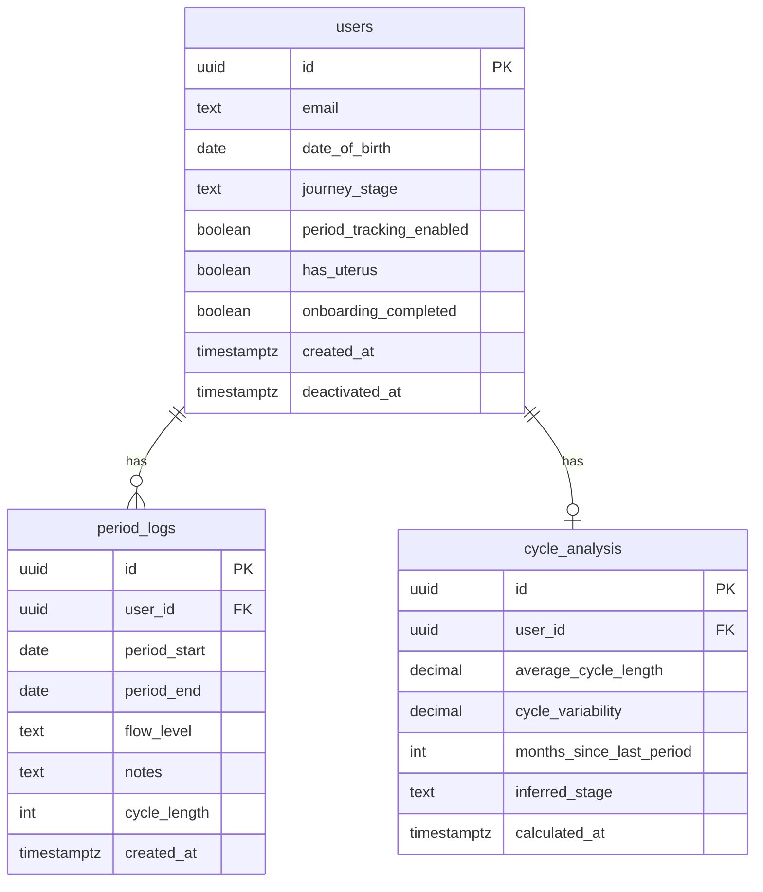

# feat: Period Tracking & Settings Page

## Overview

Add optional, flexible period tracking to Meno with a calendar view and a new general settings page. Period data serves dual purpose: comprehensive menstrual health logging AND perimenopause/menopause journey context to inform the LLM and stage inference. This is explicitly NOT a fertility tracker — bleeding patterns are a clinical signal for menopause health management.

Key guardrail: if a user's journey stage is `post-menopause` and they log any bleeding, display an immediate clinical alert recommending they see a doctor.

## Problem Statement

Users currently have no way to log their period data. Journey stage (`perimenopause` / `menopause` / `post-menopause`) is set once at onboarding and never revisited — even though this is the most important context variable for the LLM. There is no settings page, so users cannot update preferences or correct their profile after onboarding.

Period irregularity is the defining characteristic of perimenopause. Without this data, Meno cannot:
- Accurately infer where a user is in their journey
- Detect the 12-month no-period milestone (clinical definition of menopause)
- Give the LLM meaningful cycle context for pattern recognition
- Surface appropriate safety alerts for postmenopausal bleeding

## Proposed Solution

### Three interconnected deliverables:

1. **Backend foundation** — New `period_logs` and `cycle_analysis` tables (already designed in DESIGN.md), plus `period_tracking_enabled` / `has_uterus` fields on users, plus a user settings PATCH endpoint to update journey stage and preferences.

2. **Settings page** (`/settings`) — General account preferences page, accessible via a new profile/avatar menu in the top-right of the navigation. Includes: period tracking toggle, has_uterus disclosure (auto-disables period tracking if false), and journey stage editor.

3. **Period calendar page** (`/period`) — Calendar view with click-to-log, flow-level color coding, retroactive entry support, 12-month inference banner, and postmenopausal bleeding alert.

## Technical Approach

### Architecture

Build order per CLAUDE.md: **Models → Repositories → Services → Dependencies → Routes → Tests**

```
Backend:
backend/app/models/period.py              ← New
backend/app/repositories/period_repository.py  ← New
backend/app/services/period.py            ← New
backend/app/services/period_base.py       ← New (ABC interface)
backend/app/api/routes/period.py          ← New
backend/app/utils/dates.py                ← Add cycle math functions
backend/app/models/users.py               ← Add settings fields
backend/app/repositories/user_repository.py  ← Add get/update settings
backend/app/api/routes/users.py           ← Add PATCH /users/settings

Frontend:
frontend/src/routes/(app)/period/+page.svelte    ← New calendar view
frontend/src/routes/(app)/settings/+page.svelte  ← New settings page
frontend/src/routes/(app)/+layout.svelte         ← Add profile menu + period nav item
frontend/src/lib/types/api.ts                    ← Add ApiEndpoints entries
frontend/src/lib/components/period/              ← PeriodLogModal.svelte, PeriodCalendar.svelte
```

### Implementation Phases

#### Phase 1: Database & Backend Foundation

**Goal:** All backend APIs working and tested.

**1.1 Database migrations (Supabase dashboard)**

Apply these DDL statements in Supabase SQL editor:
Add to backend/migrations

```sql
-- Add period tracking preferences to users
ALTER TABLE users
  ADD COLUMN period_tracking_enabled BOOLEAN NOT NULL DEFAULT TRUE,
  ADD COLUMN has_uterus BOOLEAN;  -- NULL = not disclosed

-- period_logs table
CREATE TABLE period_logs (
  id              UUID DEFAULT gen_random_uuid() PRIMARY KEY,
  user_id         UUID NOT NULL REFERENCES users(id) ON DELETE CASCADE,
  period_start    DATE NOT NULL,
  period_end      DATE,
  flow_level      TEXT CHECK (flow_level IN ('spotting', 'light', 'medium', 'heavy')),
  notes           TEXT,
  cycle_length    INTEGER,  -- days since previous period_start (calculated server-side)
  created_at      TIMESTAMPTZ DEFAULT NOW()
);

-- RLS
ALTER TABLE period_logs ENABLE ROW LEVEL SECURITY;
CREATE POLICY "Users can manage own period logs"
  ON period_logs FOR ALL
  USING (auth.uid() = user_id)
  WITH CHECK (auth.uid() = user_id);

-- Index for efficient date-range queries
CREATE INDEX idx_period_logs_user_date ON period_logs (user_id, period_start DESC);

-- cycle_analysis table
CREATE TABLE cycle_analysis (
  id                          UUID DEFAULT gen_random_uuid() PRIMARY KEY,
  user_id                     UUID NOT NULL REFERENCES users(id) ON DELETE CASCADE,
  average_cycle_length        DECIMAL,
  cycle_variability           DECIMAL,  -- standard deviation; high variability = perimenopause indicator
  months_since_last_period    INTEGER,
  inferred_stage              TEXT CHECK (inferred_stage IN ('perimenopause', 'menopause', 'post-menopause')),
  calculated_at               TIMESTAMPTZ DEFAULT NOW()
);

ALTER TABLE cycle_analysis ENABLE ROW LEVEL SECURITY;
CREATE POLICY "Users can manage own cycle analysis"
  ON cycle_analysis FOR ALL
  USING (auth.uid() = user_id)
  WITH CHECK (auth.uid() = user_id);

-- One row per user (upsert pattern)
CREATE UNIQUE INDEX idx_cycle_analysis_user ON cycle_analysis (user_id);
```

**1.2 Models** (`backend/app/models/period.py`)

```python
class PeriodLogCreate(BaseModel):
    period_start: date
    period_end: Optional[date] = None
    flow_level: Optional[Literal['spotting', 'light', 'medium', 'heavy']] = None
    notes: Optional[str] = None

class PeriodLogUpdate(BaseModel):
    period_end: Optional[date] = None
    flow_level: Optional[Literal['spotting', 'light', 'medium', 'heavy']] = None
    notes: Optional[str] = None

class PeriodLogResponse(BaseModel):
    id: UUID
    user_id: UUID
    period_start: date
    period_end: Optional[date]
    flow_level: Optional[str]
    notes: Optional[str]
    cycle_length: Optional[int]
    created_at: datetime

class PeriodLogListResponse(BaseModel):
    logs: list[PeriodLogResponse]
    total: int

class CycleAnalysisResponse(BaseModel):
    average_cycle_length: Optional[float]
    cycle_variability: Optional[float]
    months_since_last_period: Optional[int]
    inferred_stage: Optional[str]
    calculated_at: Optional[datetime]
    has_sufficient_data: bool  # True if >= 3 cycles logged
```

**1.3 User settings models** (`backend/app/models/users.py`)

Add to existing models:

```python
class UserSettingsResponse(BaseModel):
    period_tracking_enabled: bool
    has_uterus: Optional[bool]
    journey_stage: Optional[str]

class UserSettingsUpdate(BaseModel):
    period_tracking_enabled: Optional[bool] = None
    has_uterus: Optional[bool] = None
    journey_stage: Optional[Literal['perimenopause', 'menopause', 'post-menopause', 'unsure']] = None
```

**1.4 Date utilities** (`backend/app/utils/dates.py`)

Add these pure functions:

```python
def calculate_cycle_length(current_start: date, previous_start: date) -> int:
    """Days between two period start dates."""
    return (current_start - previous_start).days

def calculate_cycle_variability(cycle_lengths: list[int]) -> float:
    """Standard deviation of cycle lengths. High values indicate perimenopause."""
    if len(cycle_lengths) < 2:
        return 0.0
    mean = sum(cycle_lengths) / len(cycle_lengths)
    variance = sum((x - mean) ** 2 for x in cycle_lengths) / len(cycle_lengths)
    return variance ** 0.5

def months_since_date(past_date: date) -> int:
    """Full months elapsed since a given date."""
    today = date.today()
    return (today.year - past_date.year) * 12 + (today.month - past_date.month)
```

**1.5 Repository** (`backend/app/repositories/period_repository.py`)

Methods:
- `async create_log(user_id, data: PeriodLogCreate) -> PeriodLogResponse` — fetches previous period to calculate cycle_length server-side; raises `DatabaseError` on failure
- `async get_logs(user_id, start_date, end_date) -> list[PeriodLogResponse]` — date-range query
- `async get_latest_log(user_id) -> Optional[PeriodLogResponse]`
- `async update_log(user_id, log_id, data: PeriodLogUpdate) -> PeriodLogResponse` — raises `EntityNotFoundError` if not found
- `async delete_log(user_id, log_id) -> None`
- `async upsert_cycle_analysis(user_id, analysis: CycleAnalysisResponse) -> None`
- `async get_cycle_analysis(user_id) -> Optional[CycleAnalysisResponse]`

User repository additions (`backend/app/repositories/user_repository.py`):
- `async get_settings(user_id) -> UserSettingsResponse`
- `async update_settings(user_id, data: UserSettingsUpdate) -> UserSettingsResponse`

**1.6 Service ABC** (`backend/app/services/period_base.py`)

```python
from abc import ABC, abstractmethod

class PeriodServiceBase(ABC):
    @abstractmethod
    async def create_log(self, user_id: str, data: PeriodLogCreate) -> PeriodLogResponse: ...

    @abstractmethod
    async def get_logs(self, user_id: str, months_back: int = 12) -> PeriodLogListResponse: ...

    @abstractmethod
    async def update_log(self, user_id: str, log_id: str, data: PeriodLogUpdate) -> PeriodLogResponse: ...

    @abstractmethod
    async def delete_log(self, user_id: str, log_id: str) -> None: ...

    @abstractmethod
    async def get_analysis(self, user_id: str) -> CycleAnalysisResponse: ...

    @abstractmethod
    def check_postmenopausal_bleeding_alert(self, journey_stage: str) -> bool: ...
```

**1.7 Service** (`backend/app/services/period.py`)

Key business logic:
- `create_log`: creates log, then recalculates and upserts `cycle_analysis` (average, variability, months since last)
- `get_analysis`: returns analysis + `has_sufficient_data` flag (≥ 3 cycles = sufficient)
- `check_postmenopausal_bleeding_alert(journey_stage)`: returns `True` if stage is `post-menopause`
- Inference: if `months_since_last_period >= 12`, sets `inferred_stage = 'menopause'` in analysis

**1.8 Dependencies** (`backend/app/api/dependencies.py`)

```python
def get_period_repo(client: SupabaseClient = Depends(get_client)) -> PeriodRepository:
    return PeriodRepository(client)

def get_period_service(
    period_repo: PeriodRepository = Depends(get_period_repo),
    user_repo: UserRepository = Depends(get_user_repo),
) -> PeriodService:
    return PeriodService(period_repo, user_repo)
```

**1.9 Routes** (`backend/app/api/routes/period.py`)

```
POST   /api/period/logs              → create log (returns log + bleeding_alert flag)
GET    /api/period/logs              → list logs (query params: start_date, end_date)
PATCH  /api/period/logs/{log_id}     → update log
DELETE /api/period/logs/{log_id}     → delete log
GET    /api/period/analysis          → get cycle analysis + stage inference
```

User settings routes (add to `backend/app/api/routes/users.py`):
```
GET    /api/users/settings           → get period_tracking_enabled, has_uterus, journey_stage
PATCH  /api/users/settings           → update any of the above
```

The `POST /api/period/logs` response should include a top-level `bleeding_alert: bool` field — evaluated by the service and returned to the frontend without the route needing to know the business logic.

**1.10 Register routes** (`backend/app/main.py`)

```python
from app.api.routes import period
app.include_router(period.router, prefix="/api/period", tags=["period"])
```

---

#### Phase 2: Settings Page

**Goal:** Users can manage journey stage, period tracking preference, and uterus disclosure from `/settings`.

**2.1 Profile/avatar menu** (`frontend/src/routes/(app)/+layout.svelte`)

Replace the current inline email + logout button with a `ProfileMenu` component:
- Shows user initials in a circular avatar (e.g., "H" from email)
- Dropdown on click: "Settings" link + "Log out" button
- Mobile: existing sidebar already has this area — add Settings link above logout

**2.2 Settings page** (`frontend/src/routes/(app)/settings/+page.svelte`)

Sections:
1. **Journey Stage** — editable select with current value pre-filled; shows plain-language descriptions per stage
2. **Cycle Tracking** — independent toggle for `period_tracking_enabled`. Any user can turn this off regardless of anatomy — e.g., someone who simply doesn't want to track. If disabled, period nav item hides and `/period` is inaccessible.
3. **Anatomy** — `has_uterus` radio group ("Yes" / "No" / "Prefer not to say"). This is a _separate, additional_ opt-out: selecting "No" also sets `period_tracking_enabled = false` with explanatory text ("Since you don't have a uterus, period tracking has been turned off"). The standalone Cycle Tracking toggle remains available to users who answered "Yes" or haven't answered.
4. **Account** — read-only email, date of birth display

All saves go through `PATCH /api/users/settings` via `apiClient`. Each section saves independently (not one big save button) to match the progressive-disclosure UX.

**2.3 Period nav item visibility**

In the layout, load user settings on mount. Show `/period` nav item only if `period_tracking_enabled = true`. Store this in a `$state` in the layout.

**2.4 TypeScript types** (`frontend/src/lib/types/api.ts`)

```typescript
'/api/users/settings': {
  GET: { response: { period_tracking_enabled: boolean; has_uterus: boolean | null; journey_stage: string | null } };
  PATCH: {
    request: { period_tracking_enabled?: boolean; has_uterus?: boolean | null; journey_stage?: string };
    response: { period_tracking_enabled: boolean; has_uterus: boolean | null; journey_stage: string | null };
  };
};
```

---

#### Phase 3: Period Calendar Page

**Goal:** Full calendar view for logging and reviewing period history.

**3.1 Calendar component strategy**

Install bits-ui primitives directly (the shadcn-svelte calendar wrapper doesn't expose enough template control):

```bash
cd frontend
npx shadcn-svelte@latest add calendar range-calendar
npm install @internationalized/date
```

Then build a custom `PeriodCalendar.svelte` component using the `bits-ui` `Calendar.Root` primitives directly. This gives full control over each cell's rendering.

**Key technical constraints:**
- All date values must use `@internationalized/date` (`CalendarDate`, `DateValue`) — not native JS `Date`
- `isPeriodDay(date)` checks against fetched `period_logs` using `date.compare()`
- Flow level → color mapping:
  - `spotting` → `bg-rose-100`
  - `light` → `bg-rose-200`
  - `medium` → `bg-rose-400 text-white`
  - `heavy` → `bg-rose-600 text-white`

**3.2 Period log modal** (`frontend/src/lib/components/period/PeriodLogModal.svelte`)

Progressive disclosure form:
- **Required:** Start date (pre-filled from clicked day)
- **Optional:** End date, flow level (radio buttons), notes (textarea)
- On submit: `POST /api/period/logs` (create) or `PATCH /api/period/logs/{id}` (edit)
- If `journey_stage = 'post-menopause'` AND logging a period: show warning banner inside the modal before the save button: *"Postmenopausal bleeding should be evaluated by a doctor promptly. Please contact your healthcare provider."*
  - The alert comes from the API response (`bleeding_alert: true`) OR can be determined client-side from cached settings
  - User is NOT blocked from logging — they can still save
- Cancel clears the form; clicking outside closes without saving

**3.3 Period page** (`frontend/src/routes/(app)/period/+page.svelte`)

Layout:
- Month header with prev/next navigation
- `PeriodCalendar` component with loaded logs for the visible month range
- "Log today" quick-add button (shortcut to open modal for today)
- 12-month inference banner (see Phase 4)

Data loading:
- `onMount`: load current + adjacent month's logs from `GET /api/period/logs?start_date=&end_date=`
- `$effect`: re-fetch when month navigation changes
- Load cycle analysis from `GET /api/period/analysis` on mount

**3.4 TypeScript types** (`frontend/src/lib/types/api.ts`)

```typescript
'/api/period/logs': {
  GET: {
    response: {
      logs: Array<{
        id: string;
        period_start: string;
        period_end: string | null;
        flow_level: 'spotting' | 'light' | 'medium' | 'heavy' | null;
        notes: string | null;
        cycle_length: number | null;
        created_at: string;
      }>;
      total: number;
    };
  };
  POST: {
    request: { period_start: string; period_end?: string; flow_level?: string; notes?: string };
    response: { log: PeriodLog; bleeding_alert: boolean };
  };
};
'/api/period/analysis': {
  GET: {
    response: {
      average_cycle_length: number | null;
      cycle_variability: number | null;
      months_since_last_period: number | null;
      inferred_stage: string | null;
      has_sufficient_data: boolean;
    };
  };
};
```

---

#### Phase 4: Journey Stage Inference Banner

**Goal:** Detect 12-month period absence and surface a non-intrusive suggestion to update journey stage.

**4.1 Detection logic** (backend, already part of `PeriodService.get_analysis`)

When `months_since_last_period >= 12` and `inferred_stage != 'post-menopause'`:
- Set `inferred_stage = 'menopause'` in `cycle_analysis`
- This is surfaced in the `GET /api/period/analysis` response as `inferred_stage`

The inference does NOT silently update `users.journey_stage`. The user must confirm.

**4.2 Frontend banner** (`/period` page)

```
┌─────────────────────────────────────────────────────────┐
│ 🌿 You haven't logged a period in 12+ months.           │
│    Would you like to update your journey stage to        │
│    Menopause?                  [Update] [Dismiss]        │
└─────────────────────────────────────────────────────────┘
```

- Only shown when `cycle_analysis.inferred_stage` differs from `users.journey_stage`
- "Update" calls `PATCH /api/users/settings` with `{ journey_stage: 'menopause' }` and hides the banner
- "Dismiss" hides for the session (no persistence — will re-appear on next visit if not updated)
- Plain, warm tone — not clinical. Not alarming.

---

## System-Wide Impact

### Interaction Graph

Logging a period triggers:
1. `POST /api/period/logs` → `PeriodService.create_log()`
2. → `PeriodRepository.create_log()` (writes `period_logs`, fetches previous log for cycle_length)
3. → `PeriodService` recalculates cycle analysis (average, variability, months since last)
4. → `PeriodRepository.upsert_cycle_analysis()` (writes `cycle_analysis`)
5. → Response includes `bleeding_alert` evaluated from user's `journey_stage`
6. Frontend shows postmenopausal alert if `bleeding_alert = true`

Updating settings (`PATCH /api/users/settings`) with `has_uterus = false`:
- Backend sets `period_tracking_enabled = false` automatically
- Frontend: next settings page load shows period tracking as disabled

### Error Propagation

- `period_logs` insert failure → `DatabaseError` → `500`
- Log not found for update/delete → `EntityNotFoundError` → `404`
- Invalid `period_start` (future date) → `ValidationError` → `400`
- `period_end` before `period_start` → `ValidationError` → `400`
- Unauthorized user → `UnauthorizedError` → `401` (handled by `CurrentUser` dependency)

### State Lifecycle Risks

- `cycle_analysis` is recalculated on every create/delete — no risk of stale data
- Deleting a period log should trigger cycle_analysis recalculation
- `journey_stage` update via settings must also be reflected in the LLM context (already read from `users` table at chat time — no additional caching concern)
- `period_tracking_enabled = false` hides the `/period` nav item client-side, but the API endpoints still exist and are protected by auth — no security risk

### Integration Test Scenarios

1. Post-menopause user logs a period → `bleeding_alert = true` in response, frontend shows alert, log is saved successfully
2. User logs 13 consecutive cycles → `cycle_analysis.average_cycle_length` accurately reflects the mean; `variability` reflects std dev
3. User logs period, then deletes it → `cycle_analysis` is recalculated (previous log becomes latest)
4. User sets `has_uterus = false` in settings → `period_tracking_enabled` becomes false, `/period` nav item disappears
5. User navigates to `/period` month with no logs → calendar renders cleanly with no highlighted days, no errors

---

## Acceptance Criteria

### Functional Requirements

**Backend:**
- [ ] `period_logs` table created with RLS (`auth.uid() = user_id`)
- [ ] `cycle_analysis` table created with RLS
- [ ] `users` table has `period_tracking_enabled` (default `true`) and `has_uterus` (nullable)
- [ ] `POST /api/period/logs` creates a log, calculates `cycle_length` from previous log, upserts cycle analysis
- [ ] `GET /api/period/logs` returns logs filtered by date range
- [ ] `PATCH /api/period/logs/{id}` updates a log (validates ownership)
- [ ] `DELETE /api/period/logs/{id}` deletes a log and recalculates cycle analysis
- [ ] `GET /api/period/analysis` returns cycle analysis with `inferred_stage` and `has_sufficient_data`
- [ ] `POST /api/period/logs` returns `bleeding_alert: true` when user's journey stage is `post-menopause`
- [ ] `GET /api/users/settings` returns `period_tracking_enabled`, `has_uterus`, `journey_stage`
- [ ] `PATCH /api/users/settings` accepts and updates any combination of the three fields
- [ ] Setting `has_uterus = false` automatically sets `period_tracking_enabled = false`
- [ ] `journey_stage` on `users` is updatable via settings endpoint

**Frontend:**
- [x] Profile/avatar menu in top-right of nav with user initials, Settings link, Logout button
- [x] `/settings` page accessible via profile menu
- [x] Journey stage editable in settings with current value pre-filled
- [x] Period tracking toggle in settings works independently — any user can opt out regardless of anatomy
- [x] `has_uterus` disclosure in settings; selecting "No" also disables period tracking (but the toggle remains the primary opt-out)
- [x] `/period` nav item visible only when `period_tracking_enabled = true`
- [x] Calendar shows month view with clickable days
- [x] Days with period logs are color-coded by flow level
- [x] Clicking a logged day opens edit modal
- [x] Clicking an unlogged day opens create modal
- [x] Log modal requires only start date; end date, flow level, notes are optional
- [x] Retroactive logging works (past months navigable)
- [x] Postmenopausal bleeding alert shown in the log modal when `journey_stage = 'post-menopause'`
- [x] 12-month inference banner appears on `/period` when `inferred_stage` differs from `journey_stage`
- [x] "Update" on inference banner calls settings PATCH and refreshes journey stage
- [x] Period tracking feature entirely hidden when `period_tracking_enabled = false`

### Non-Functional Requirements

- [ ] All user data tables have RLS enabled — no cross-user data access possible
- [ ] PII-safe logging: no period dates, notes, or flow levels in logs (use `hash_user_id()`)
- [ ] Medical advice boundary: postmenopausal bleeding alert informs without diagnosing
- [ ] Calendar loads within 1s for 12 months of data
- [ ] All interactive elements ≥ 44×44px (WCAG 2.1 AA)
- [ ] Inference banner is dismissible and non-alarming in tone

### Quality Gates

- [ ] >70% test coverage on `period_repository.py` and `period_service.py`
- [ ] All date math functions in `utils/dates.py` have unit tests
- [ ] Test naming follows `test_X_when_Y_then_Z`
- [ ] No `HTTPException` raised in repository or service layers

---

## Database Schema Diagram



---

## Alternative Approaches Considered

### Calendar component: shadcn-svelte wrapper vs bits-ui primitives
The shadcn-svelte `<Calendar />` wrapper does not expose the day iteration loop, making custom per-cell highlighting impossible. Using `bits-ui` primitives directly (via `npx shadcn-svelte add calendar` which generates editable source) gives full template control with zero extra dependencies. *(see brainstorm: docs/brainstorms/2026-03-16-period-tracking-brainstorm.md)*

### Period tracking opt-in vs opt-out
Default `period_tracking_enabled = true` with the feature visible unless turned off. This is the correct default since this is a menopause app where period tracking is core functionality, not peripheral. Users who have had a hysterectomy or otherwise don't need it can disable it. *(see brainstorm)*

### Settings: feature-specific page vs general settings
A general `/settings` page (not cycle-specific) is the right choice — journey stage, uterus disclosure, and period tracking are all closely related, and general settings creates room for future preferences (notifications, account management, etc.) without a proliferating nav structure. *(see brainstorm)*

### Journey stage inference: silent update vs consent-gated
Never silently update `users.journey_stage`. The 12-month milestone is clinically significant and personal — users should confirm it. The inference banner on `/period` gives them agency. *(see brainstorm)*

---

## Dependencies & Prerequisites

- Supabase SQL migrations applied (Phase 1.1) before any backend code runs
- `@internationalized/date` installed in frontend (`npm install @internationalized/date`)
- `bits-ui` calendar primitives added (`npx shadcn-svelte add calendar range-calendar`)
- No new external APIs — all data is local to the app

## Future Considerations (V3+)

- Surface period patterns to the LLM context (average cycle length, variability, months since last) so Ask Meno responses are cycle-aware
- Export period data in the general export (already has an export feature — just extend the export service)
- Cycle predictions ("estimated next period") once ≥ 6 cycles logged
- Symptom-cycle correlation analysis ("your brain fog is most frequent in the week before your period")
- Contraception-aware cycle modeling

---

## Sources & References

### Origin

- **Brainstorm document:** [docs/brainstorms/2026-03-16-period-tracking-brainstorm.md](../brainstorms/2026-03-16-period-tracking-brainstorm.md)
  Key decisions carried forward: (1) period tracking is optional with `has_uterus` gating, (2) calendar view with retroactive logging, (3) postmenopausal bleeding alert, (4) journey stage inference with user consent, (5) Settings accessible via profile menu.

### Internal References

- DB schema: `docs/dev/DESIGN.md` Section 9 — `period_logs` and `cycle_analysis` already modeled
- Backend patterns: `docs/dev/backend/V2CODE_EXAMPLES.md` — repository, service, ABC, dependency injection
- Build order example: `docs/dev/backend/VERTICAL_SLICE_EXAMPLE.md`
- PII logging: `docs/dev/backend/LOGGING.md`
- Frontend patterns: `docs/dev/frontend/V2CODE_EXAMPLES.md`
- Supabase mock helpers: `backend/tests/fixtures/supabase.py`
- Existing symptom logging (closest pattern): `backend/app/repositories/symptoms_repository.py`, `backend/app/api/routes/symptoms.py`
- Current app layout (nav): `frontend/src/routes/(app)/+layout.svelte`
- Date utilities (extend): `backend/app/utils/dates.py`
- API type system: `frontend/src/lib/types/api.ts`

### External References

- [Bits UI Calendar documentation](https://bits-ui.com/docs/components/calendar) — custom day rendering with `children` snippet
- [Bits UI Range Calendar](https://bits-ui.com/docs/components/range-calendar) — range selection UX
- [`@internationalized/date`](https://react-spectrum.adobe.com/internationalized/date/) — date value type for calendar components; use `CalendarDate` and `compare()` for all range checks
