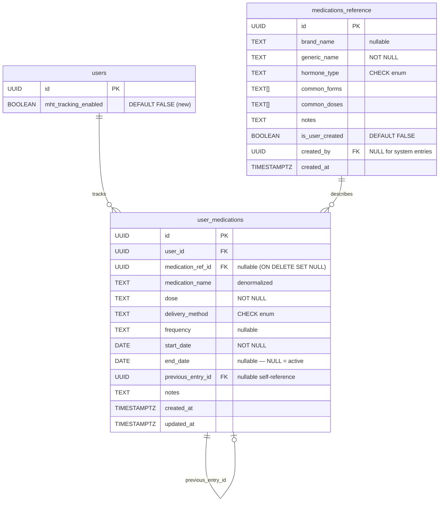

# feat: MHT Medication Tracking

## Overview

Add Menopausal Hormone Therapy (MHT) medication tracking to Meno. Users can record what they're taking, at what dose and delivery method, and when they started or changed. A before/after symptom comparison view lets users see how symptom patterns shifted around a medication change. Medication context integrates into Appointment Prep, PDF Export, and Ask Meno.

The feature follows the existing optional-feature pattern: off by default, toggled in Settings, nav link hidden when disabled. Existing data is preserved (not deleted) when the toggle is turned off.

---

## Problem Statement

Women on MHT frequently adjust medications over months or years. Without tracking, they lose the ability to connect medication changes to symptom patterns. Meno already captures symptom and period data — medication tracking is the missing variable that makes both more meaningful.

---

## Key Decisions (From Brainstorm)

_(See brainstorm: `docs/brainstorms/2026-03-18-mht-medication-tracking-brainstorm.md`)_

| Decision                    | Choice                               | Rationale                                                                |
| --------------------------- | ------------------------------------ | ------------------------------------------------------------------------ |
| Patch replacement reminders | **Skip (Option A)**                  | Core feature already substantial; users have workarounds                 |
| Before/after threshold      | **Always show, note sparse data**    | Some MHT effects are rapid (hours); gating on 14 days hides early signal |
| Ramp-up exclusion           | **Skip — after window starts day 1** | Disclaimer handles clinical nuance; simpler UX                           |

### Additional Decisions (Resolved During Planning)

| Decision                                  | Choice                                                                      | Rationale                                                                                                    |
| ----------------------------------------- | --------------------------------------------------------------------------- | ------------------------------------------------------------------------------------------------------------ |
| `POST /medications/{id}/change` atomicity | **Postgres RPC function**                                                   | Two-write operation must be atomic; Supabase Python client has no native multi-statement transaction support |
| `PUT /medications/{id}` allowed fields    | **Only `notes` and `end_date`**                                             | Dose/method changes always create a new stint; protects timeline integrity                                   |
| Date validation                           | **Backend + frontend both validate**                                        | Defense in depth; backend is authoritative                                                                   |
| Feature toggle enforcement                | **Service layer**                                                           | `GET /medications/current` returns empty list if `mht_tracking_enabled = FALSE`                              |
| Add/Change/Stop UI flows                  | **Add = route; Change/Stop = inline modals**                                | Keeps `/medications` as the primary surface; reduces navigation                                              |
| "Edit" button rename                      | **"Change"**                                                                | "Edit" implies in-place; "Change" signals a new record will be created                                       |
| Frequency field                           | **Free-text + delivery-method-based suggestions**                           | Avoids over-constraining; provides helpful defaults                                                          |
| Comparison window floor                   | **Floor of 1 day**                                                          | Zero-day after window (started today) shows "Check back tomorrow"                                            |
| "Multiple changes" note in comparison     | **Static UI component**                                                     | Checks for other medication events in window; no LLM involvement                                             |
| Symptom cache invalidation                | **Async / fire-and-forget**                                                 | Don't slow down medication add/change/stop                                                                   |
| Both PDFs get medications section         | **Yes**                                                                     | Both Appointment Prep PDF and standalone Export PDF include current medications                              |
| Export "active during" query              | `start_date <= range_end AND (end_date IS NULL OR end_date >= range_start)` | Captures all stints active at any point in the export range                                                  |
| Ask Meno context scope                    | **Current medications + stopped within last 90 days**                       | Recently stopped medications are relevant context                                                            |

---

## Data Model

### ERD



### New Migration: `add_mht_medication_tracking.sql`

```sql
-- 1. Add toggle to users table
ALTER TABLE users ADD COLUMN mht_tracking_enabled BOOLEAN DEFAULT FALSE;

-- 2. medications_reference (system-managed + user-created)
CREATE TABLE IF NOT EXISTS medications_reference (
    id               UUID PRIMARY KEY DEFAULT gen_random_uuid(),
    brand_name       TEXT,
    generic_name     TEXT NOT NULL,
    hormone_type     TEXT NOT NULL CHECK (hormone_type IN (
                       'estrogen', 'progesterone', 'progestin',
                       'testosterone', 'combination'
                     )),
    common_forms     TEXT[] DEFAULT '{}',
    common_doses     TEXT[] DEFAULT '{}',
    notes            TEXT,
    is_user_created  BOOLEAN DEFAULT FALSE,
    created_by       UUID REFERENCES auth.users(id) ON DELETE SET NULL,
    created_at       TIMESTAMPTZ DEFAULT NOW()
);

-- 3. user_medications (timeline model)
CREATE TABLE IF NOT EXISTS user_medications (
    id                  UUID PRIMARY KEY DEFAULT gen_random_uuid(),
    user_id             UUID NOT NULL REFERENCES auth.users(id) ON DELETE CASCADE,
    medication_ref_id   UUID REFERENCES medications_reference(id) ON DELETE SET NULL,
    medication_name     TEXT NOT NULL,
    dose                TEXT NOT NULL,
    delivery_method     TEXT NOT NULL CHECK (delivery_method IN (
                          'patch', 'pill', 'gel', 'cream', 'ring',
                          'injection', 'pellet', 'spray', 'troche',
                          'sublingual', 'other'
                        )),
    frequency           TEXT,
    start_date          DATE NOT NULL,
    end_date            DATE,
    previous_entry_id   UUID REFERENCES user_medications(id) ON DELETE SET NULL,
    notes               TEXT CHECK (char_length(notes) <= 1000),
    created_at          TIMESTAMPTZ DEFAULT NOW(),
    updated_at          TIMESTAMPTZ DEFAULT NOW(),
    CONSTRAINT end_date_after_start CHECK (end_date IS NULL OR end_date >= start_date)
);

-- 4. Indexes
CREATE INDEX idx_user_medications_user_id ON user_medications(user_id, start_date DESC);
CREATE INDEX idx_user_medications_active ON user_medications(user_id) WHERE end_date IS NULL;
CREATE INDEX idx_medications_reference_search ON medications_reference
    USING gin(to_tsvector('english', coalesce(brand_name, '') || ' ' || generic_name));

-- 5. RLS
ALTER TABLE medications_reference ENABLE ROW LEVEL SECURITY;
ALTER TABLE user_medications ENABLE ROW LEVEL SECURITY;

-- medications_reference: system entries readable by all; user-created scoped to creator
CREATE POLICY "Anyone reads system medication entries"
    ON medications_reference FOR SELECT
    USING (is_user_created = FALSE);

CREATE POLICY "Users read own created entries"
    ON medications_reference FOR SELECT
    USING (is_user_created = TRUE AND created_by = auth.uid());

CREATE POLICY "Users insert own medication entries"
    ON medications_reference FOR INSERT
    WITH CHECK (is_user_created = TRUE AND created_by = auth.uid());

CREATE POLICY "Users update own created entries"
    ON medications_reference FOR UPDATE
    USING (is_user_created = TRUE AND created_by = auth.uid());

CREATE POLICY "Users delete own created entries"
    ON medications_reference FOR DELETE
    USING (is_user_created = TRUE AND created_by = auth.uid());

-- user_medications: standard user isolation
CREATE POLICY "Users read own medications"
    ON user_medications FOR SELECT
    USING (auth.uid() = user_id);

CREATE POLICY "Users insert own medications"
    ON user_medications FOR INSERT
    WITH CHECK (auth.uid() = user_id);

CREATE POLICY "Users update own medications"
    ON user_medications FOR UPDATE
    USING (auth.uid() = user_id);

CREATE POLICY "Users delete own medications"
    ON user_medications FOR DELETE
    USING (auth.uid() = user_id);

-- 6. Atomic change_dose RPC function
CREATE OR REPLACE FUNCTION change_medication_dose(
    p_old_id UUID,
    p_user_id UUID,
    p_effective_date DATE,
    p_new_dose TEXT,
    p_new_delivery_method TEXT,
    p_new_frequency TEXT,
    p_new_notes TEXT,
    p_medication_ref_id UUID,
    p_medication_name TEXT
) RETURNS UUID AS $$
DECLARE
    v_old_start DATE;
    v_new_id UUID;
BEGIN
    -- Verify ownership and fetch start_date
    SELECT start_date INTO v_old_start
    FROM user_medications
    WHERE id = p_old_id AND user_id = p_user_id;

    IF NOT FOUND THEN
        RAISE EXCEPTION 'medication_not_found';
    END IF;

    -- Validate effective_date > old start_date
    IF p_effective_date <= v_old_start THEN
        RAISE EXCEPTION 'effective_date_before_start';
    END IF;

    -- End the old stint
    UPDATE user_medications
    SET end_date = p_effective_date - INTERVAL '1 day',
        updated_at = NOW()
    WHERE id = p_old_id AND user_id = p_user_id;

    -- Create the new stint
    INSERT INTO user_medications (
        user_id, medication_ref_id, medication_name,
        dose, delivery_method, frequency,
        start_date, notes, previous_entry_id
    ) VALUES (
        p_user_id, p_medication_ref_id, p_medication_name,
        p_new_dose, p_new_delivery_method, p_new_frequency,
        p_effective_date, p_new_notes, p_old_id
    ) RETURNING id INTO v_new_id;

    RETURN v_new_id;
END;
$$ LANGUAGE plpgsql SECURITY DEFINER;

COMMENT ON TABLE medications_reference IS 'System-curated and user-created MHT medication reference. User-created entries are RLS-scoped to the creator.';
COMMENT ON TABLE user_medications IS 'Timeline of user MHT medication stints. Each row = one stint. Dose/method changes create a new row with previous_entry_id linking back.';
```

### Reference Data Seed: `seed_medications_reference.sql`

Seed file with all medications from the PRD reference table (estrogen, progesterone, combination, testosterone). Approximately 25 rows. See PRD Section "Reference Data: Initial Medication Seed" for full list.

---

## Technical Approach

### Architecture

Follows the standard Meno layered pattern: Models → Repositories → Services → Dependencies → Routes → Tests.

**Build order:**

1. Migration + seed
2. Backend models
3. Repositories (`MedicationReferenceRepository`, `MedicationRepository`)
4. Services (`MedicationService`)
5. Dependency wiring (`dependencies.py`)
6. Routes (`/api/medications`)
7. Integration updates (Appointment Prep, Export, Ask Meno)
8. Settings backend update
9. Tests (backend)
10. Frontend: settings toggle → nav → `/medications` page → add flow → before/after view
11. Frontend: integration updates (Appointment Prep PDF preview, Export PDF)

### Division of Labor

| Task                                          | Layer                           | Notes                                      |
| --------------------------------------------- | ------------------------------- | ------------------------------------------ |
| CRUD for medication records                   | Repository + Service            | Standard                                   |
| Before/after frequency calculation            | Python (`utils/stats.py`)       | Reuse existing `calculate_frequency_stats` |
| Time window calculation                       | Python (`utils/dates.py`)       | Date math, deterministic                   |
| Reference search (autocomplete)               | SQL ILIKE via Repository        | GIN index for full-text                    |
| Atomic dose change                            | Postgres RPC                    | Two-write atomicity                        |
| Narrative with medication context (Appt Prep) | LLM                             | Meaning-making                             |
| Educational medication Q&A (Ask Meno)         | LLM + RAG                       | Grounded responses                         |
| Cache invalidation on medication write        | Service (async fire-and-forget) | Don't block medication writes              |

---

## Implementation Phases

### Phase 1: Database & Backend Core

**Deliverables:**

- Migration `add_mht_medication_tracking.sql`
- Seed `seed_medications_reference.sql`
- Pydantic models (request, response, domain)
- `MedicationReferenceRepository` + `MedicationRepository`
- `MedicationService` + `MedicationServiceBase` (ABC)
- `GET/POST /medications/reference`, `GET /medications`, `POST /medications`, `PUT /medications/{id}`, `POST /medications/{id}/change`, `DELETE /medications/{id}` (optional, for correction flows)
- `GET /medications/current` (for integration consumers)
- `GET /medications/{id}/symptom-comparison`
- `UserSettingsUpdate` + `UserSettingsResponse` updated with `mht_tracking_enabled`
- `PATCH /api/users/settings` updated
- Unit tests for all layers

**Files to create:**

- `backend/app/migrations/add_mht_medication_tracking.sql`
- `backend/app/migrations/seed_medications_reference.sql`
- `backend/app/models/medications.py`
- `backend/app/repositories/medication_repository.py`
- `backend/app/services/medication_base.py`
- `backend/app/services/medication.py`
- `backend/tests/repositories/test_medication_repository.py`
- `backend/tests/services/test_medication_service.py`
- `backend/tests/api/routes/test_medications.py`

**Files to modify:**

- `backend/app/models/users.py` — add `mht_tracking_enabled` to `UserSettingsResponse` + `UserSettingsUpdate`
- `backend/app/repositories/user_repository.py` — add `mht_tracking_enabled` to `get_settings` and `update_settings`
- `backend/app/api/routes/medications.py` — new file
- `backend/app/api/dependencies.py` — wire `MedicationRepository` and `MedicationService`
- `backend/app/main.py` — register medications router

### Phase 2: Before/After Symptom Comparison

**Deliverables:**

- `GET /medications/{id}/symptom-comparison` endpoint returning before/after frequency data
- Python calculation using existing `calculate_frequency_stats` with two date range queries
- Direction indicators (>10pp change = arrow, else neutral)
- Handles: zero-day after window, sparse data in either window, no data in one window

**Calculation approach:**

```python
# In MedicationService.get_symptom_comparison(user_id, medication_id):
stint = await self.medication_repo.get(user_id, medication_id)
n_days = min((today - stint.start_date).days, 90)
if n_days == 0:
    return SymptomComparisonResponse(has_after_data=False)

before_start = stint.start_date - timedelta(days=n_days)
before_end = stint.start_date - timedelta(days=1)
after_start = stint.start_date
after_end = stint.end_date or today

# Two calls using existing SymptomsRepository.get_logs_with_reference
before_logs, ref = await self.symptoms_repo.get_logs_with_reference(
    user_id, before_start, before_end
)
after_logs, _ = await self.symptoms_repo.get_logs_with_reference(
    user_id, after_start, min(after_end, after_start + timedelta(days=n_days))
)

before_stats = calculate_frequency_stats(before_logs, ref)
after_stats = calculate_frequency_stats(after_logs, ref)
# Merge into side-by-side response...
```

**Files to modify:**

- `backend/app/services/medication.py` — add `get_symptom_comparison` method
- `backend/app/models/medications.py` — add `SymptomComparisonResponse`
- `backend/tests/services/test_medication_service.py` — comparison tests

### Phase 3: Feature Integrations

**3a. Ask Meno context injection:**

Extend `AskMenoService.ask()` to fetch medication context in the existing `asyncio.gather` block (alongside cycle analysis). If `mht_tracking_enabled` is false, the gather returns immediately with an empty list (gated in service).

```python
# In AskMenoService.ask(), extend existing gather:
cycle_result, settings_result, med_result = await asyncio.gather(
    self.period_repo.get_cycle_analysis(user_id),
    self.user_repo.get_settings(user_id),
    self.medication_repo.get_current_with_recent_changes(user_id, lookback_days=90),
    return_exceptions=True,
)
```

Layer 4 addition in `PromptService.build_system_prompt`:

```
## Current Medications
[Medication name] [dose] via [delivery method] — started [duration ago]
...

## Recent Medication Changes (last 90 days)
[Date]: Changed from [old dose] to [new dose]
[Date]: Stopped [medication name]
```

**3b. Appointment Prep narrative:**

Add `MedicationRepository` to `AppointmentService.__init__`. Fetch current medications before building narrative. Add medication context to `_build_narrative_prompts` user prompt string. Same gate on `mht_tracking_enabled`.

**3c. PDF Export:**

Add `MedicationRepository` to `ExportService.__init__`. Before building the PDF, fetch medications active during the export date range (`start_date <= range_end AND (end_date IS NULL OR end_date >= range_start)`). Insert "Current Medications" section after the header, before "Symptom Pattern Summary." Factual data only — no LLM commentary.

**3d. Appointment Prep PDF (Step 5):**

Same medications section added. The Appointment Prep PDF uses `markdown_to_pdf` — add a markdown-formatted medications section to the generated markdown string.

**Files to modify:**

- `backend/app/services/ask_meno.py`
- `backend/app/services/prompts.py`
- `backend/app/services/appointment.py`
- `backend/app/services/pdf.py` (export PDF)
- `backend/app/api/dependencies.py` (inject MedicationRepository into AppointmentService + AskMenoService + ExportService)
- `backend/tests/services/test_ask_meno_service.py`
- `backend/tests/services/test_appointment_service.py`

### Phase 4: Frontend

**4a. Settings toggle:**

Add `mht_tracking_enabled` to `UserSettings` interface in `frontend/src/lib/stores/settings.ts`. Add `saveMhtTracking()` function to settings page (same pattern as `saveCycleTracking`). After successful API call, update `userSettings.set(settings)` store so nav updates reactively without page reload.

**4b. Nav visibility:**

In `frontend/src/routes/(app)/+layout.svelte`, add:

```typescript
const mhtTrackingEnabled = $derived(
  $userSettings?.mht_tracking_enabled ?? false,
);

const navLinks = $derived([
  ...baseNavLinks,
  ...(periodTrackingEnabled ? [{ href: "/period", label: "Cycles" }] : []),
  ...(mhtTrackingEnabled
    ? [{ href: "/medications", label: "Medications" }]
    : []),
]);
```

**4c. Route guard:**

`frontend/src/routes/(app)/medications/+page.ts` — check `userSettings.mht_tracking_enabled` on load; redirect to `/` if disabled (same pattern as period tracking).

**4d. Medications page (`/medications`):**

- `onMount(loadData)` pattern
- **Current Medications section:** one card per active stint (`end_date IS NULL`), showing: name, dose, delivery method, frequency, "Started X days/weeks/months ago", [Change] [Stop] [See symptom impact] actions
- **Past Medications section:** collapsible, grouped by `medication_name`, timeline of stints per medication
- **Empty state:** "No medications added yet. Add your first medication to start tracking." with primary CTA button
- **"Add Medication" button** → navigates to `/medications/add`
- **Change dose modal:** inline `<dialog>` or drawer — pre-filled form, effective date picker (constrained `> start_date`), saves via `POST /medications/{id}/change`
- **Stop modal:** inline — date picker (constrained `>= start_date`, defaults to today), optional notes, saves via `PUT /medications/{id}` updating `end_date`

**4e. Add medication flow (`/medications/add`):**

Multi-step form as a single page with progressive disclosure:

1. **Search step:** typeahead against `GET /medications/reference?search=`, shows brand + generic name, "Not listed? Add it" link
2. **Custom medication form** (shown when "Add it" clicked): generic name, hormone type, common forms (multi-select chips), common doses (free-text, can add multiple)
3. **Dose step:** dropdown of `common_doses` from selected reference (if available) + "Enter different dose" free-text fallback
4. **Delivery method step:** radio buttons pre-filtered to `common_forms` from reference; always show "Other" as last option
5. **Frequency step:** free-text input with quick-select chips based on delivery method (patch → "twice weekly", "weekly"; pill → "daily"; etc.)
6. **Date step:** start date picker (defaults today, can be past), optional notes
7. **Confirm + save**

**4f. Before/after comparison (`/medications/{id}/impact`):**

- Fetches `GET /medications/{id}/symptom-comparison`
- Two-column layout with medication name + date ranges in headers
- Symptom rows: symptom name | before % (count/days) | direction arrow | after % (count/days)
- Arrows: ↓ = improved (>10pp decrease), ↑ = worsened (>10pp increase), → = stable
- Sparse data note: shown when either window < 14 days of logs
- Zero-day after window: "Check back tomorrow — not enough time has passed to compare yet"
- Multiple changes note: static banner if other medication events fall within either window
- Disclaimer per PRD
- Window adjustment: two pairs of date pickers (before range, after range) + "Recalculate" button; triggers new API call

**4g. Medication history (`/medications/{id}`):**

Timeline view for a single medication — all stints in chronological order with date ranges, doses, delivery methods, durations, notes. Link to before/after comparison from here.

**Files to create:**

- `frontend/src/lib/types/medications.ts`
- `frontend/src/routes/(app)/medications/+page.svelte`
- `frontend/src/routes/(app)/medications/+page.ts` (route guard)
- `frontend/src/routes/(app)/medications/add/+page.svelte`
- `frontend/src/routes/(app)/medications/[id]/+page.svelte`
- `frontend/src/routes/(app)/medications/[id]/impact/+page.svelte`

**Files to modify:**

- `frontend/src/lib/stores/settings.ts`
- `frontend/src/routes/(app)/+layout.svelte`
- `frontend/src/routes/(app)/settings/+page.svelte`

---

## System-Wide Impact

### Interaction Graph

**Medication add (`POST /medications`):**

1. Route → `MedicationService.add()` → `MedicationRepository.create()` (Supabase INSERT)
2. After insert: `MedicationService` fires `_invalidate_summary_cache()` (async, fire-and-forget)
3. `_invalidate_summary_cache()` → `SymptomsRepository.invalidate_cache()` (new row with `generated_at = NOW()` so the next `get_summary()` query picks the old cached summary until background job regenerates)

**Medication dose change (`POST /medications/{id}/change`):**

1. Route → `MedicationService.change_dose()` → `MedicationRepository.change_dose()` → Supabase RPC `change_medication_dose()`
2. RPC atomically: UPDATE old stint `end_date`, INSERT new stint with `previous_entry_id`
3. After RPC: async cache invalidation (same as above)

**Ask Meno query (when `mht_tracking_enabled = TRUE`):**

1. `AskMenoService.ask()` → `asyncio.gather(cycle_analysis, settings, medication_context)`
2. Medication context added to Layer 4 of `PromptService.build_system_prompt()`
3. Prompt sent to LLM with medication names + doses (anonymized — no user identifiers, no provider names)

### Error & Failure Propagation

| Operation                                            | Error Class                                         | HTTP Status | Notes                                                                     |
| ---------------------------------------------------- | --------------------------------------------------- | ----------- | ------------------------------------------------------------------------- |
| Medication not found                                 | `EntityNotFoundError`                               | 404         | Raised in repository                                                      |
| Invalid dates (end < start)                          | `ValidationError`                                   | 400         | Raised in service before repository call                                  |
| Effective date before stint start                    | `ValidationError`                                   | 400         | Raised in service; also enforced in RPC                                   |
| Unauthorized access (wrong user)                     | `EntityNotFoundError`                               | 404         | Repository double-filters by id + user_id (IDOR protection per learnings) |
| RPC failure on dose change                           | `DatabaseError`                                     | 500         | Postgres rolls back atomically                                            |
| Medication context fetch failure in Ask Meno         | Logged, graceful degradation                        | —           | `asyncio.gather(return_exceptions=True)` pattern                          |
| Medication context fetch failure in Appointment Prep | Logged, feature proceeds without medication context | —           | Same optional-enrichment pattern                                          |

### State Lifecycle Risks

**Partial failure risk: Change Dose**
Mitigated entirely by the Postgres RPC function — both writes happen in a single transaction. If the INSERT fails, the UPDATE rolls back. No compensating logic needed in Python.

**Dangling reference: `medication_ref_id` on user-created entry deletion**
Schema uses `ON DELETE SET NULL` on `user_medications.medication_ref_id`. The `medication_name` denormalization ensures the stint record remains meaningful after the reference is deleted.

**Stale medication context in LLM**
The symptom summary cache is append-only (new row = new cache entry). Medication context is fetched fresh on every Ask Meno query and Appointment Prep call — not cached. No staleness risk for the injection path.

**Two active stints for the same medication (data integrity)**
The RPC function prevents duplicate active stints for the medication being changed. However, a user could manually create two active stints via the "Add Medication" flow for the same medication. This is not prevented at the database level (no composite unique constraint). The UI should warn if the user adds a medication that appears to already be active, but this is handled at the service/frontend level, not the schema.

### API Surface Parity

- `GET /medications/current` — used by Appointment Prep, Export, and Ask Meno integration paths. All three consumers receive the same data; no separate endpoints per consumer.
- `UserSettingsResponse` — adding `mht_tracking_enabled` affects all callers of `GET /api/users/settings` (settings page, layout). Frontend already handles unknown fields gracefully.
- `PromptService.build_system_prompt` — signature will need a new optional `medication_context` parameter. All callers must be updated to pass `None` if medication tracking is disabled.

### Integration Test Scenarios

1. **User enables tracking, adds a medication, queries Ask Meno:** Assert that the Ask Meno LLM prompt includes the medication name and dose in Layer 4.
2. **User changes dose mid-month, generates export:** Assert that the PDF includes both the old stint (as a "medication change" entry) and the new stint (as the active medication) within the export date range.
3. **User disables tracking after adding medications:** Assert that `GET /medications/current` returns empty list, Ask Meno prompt contains no medication block, export PDF has no medications section.
4. **Change dose RPC partial failure simulation:** Mock Supabase RPC to raise an exception; assert the old stint's `end_date` was NOT set (transaction rolled back), and the response is a 500.
5. **Before/after comparison with medication started today:** Assert response has `has_after_data = False` and the API returns 200 (not 404 or 400).

---

## Acceptance Criteria

### Functional

- [ ] `mht_tracking_enabled` boolean added to `users` table, defaulting to `FALSE`
- [ ] `medications_reference` table created with system seed data (~25 medications)
- [ ] `user_medications` table created with all columns, constraints, and indexes
- [ ] RLS policies enforce: system reference entries readable by all; user-created entries scoped to creator; user_medications scoped to owner
- [ ] `POST /medications/{id}/change` is atomic (Postgres RPC rollback on failure)
- [ ] `PUT /medications/{id}` only accepts `notes` and `end_date` updates (dose/method rejected)
- [ ] `GET /medications/current` returns empty list when `mht_tracking_enabled = FALSE`
- [ ] Settings toggle updates `mht_tracking_enabled` and the nav link appears/disappears reactively without page reload
- [ ] `/medications` route shows current medications (active stints) and past medications (grouped, collapsible)
- [ ] Add medication flow: search reference, select or add custom, choose dose/method/frequency/date
- [ ] Change dose flow: atomic, creates new stint, old stint end_date set to effective_date - 1
- [ ] Stop medication flow: sets `end_date`, card moves to past section
- [ ] Before/after comparison: correct frequency calculations, direction arrows, sparse data note, zero-day after window handled
- [ ] Ask Meno includes current medications + last 90 days of changes in Layer 4 when tracking enabled
- [ ] Appointment Prep narrative includes medication context when tracking enabled
- [ ] Both Export PDF and Appointment Prep PDF include Current Medications section when tracking enabled
- [ ] `symptom_summary_cache` invalidated (async) on medication add/change/stop

### Non-Functional

- [ ] Response models do not include `user_id` (per institutional learning)
- [ ] All repository write operations double-filter by `id` AND `user_id` (IDOR protection)
- [ ] `model_fields_set` used for all PATCH/partial-update endpoints
- [ ] Medication names and doses never appear in log output (PII-safe logging)
- [ ] No medical advice crossed: before/after view includes disclaimer; Ask Meno does not evaluate appropriateness of dose or suggest changes

### Quality Gates

- [ ] > 80% test coverage on `MedicationService` and `MedicationRepository`
- [ ] All existing tests continue to pass (no regressions)
- [ ] `ruff check && ruff format` passes on all new/modified Python files
- [ ] Frontend builds without TypeScript errors
- [ ] WCAG 2.1 AA: all interactive elements ≥ 44×44px; form labels present; date pickers keyboard-accessible

---

## Alternative Approaches Considered

### Change Dose: Two Sequential Writes with Compensation

**Rejected.** Two sequential Supabase writes (`UPDATE` then `INSERT`) with Python-level rollback (re-open old stint if insert fails) are error-prone and race-prone. A Postgres RPC function is the correct tool — it's atomic, server-side, and eliminates the entire class of partial-failure corruption.

### User-Created Medications Shared with All Users

**Rejected.** Sharing user-created entries across users risks: (1) typo pollution in autocomplete, (2) prompt injection via user-controlled medication names injected into LLM context. Privacy is maintained by scoping user-created entries to the creator only.

### Separate `medications_settings` Table

**Rejected.** Period tracking uses a boolean on the `users` table. Consistency with the existing pattern is preferred over a new table for a single boolean.

### Ramp-Up Window Exclusion

**Rejected (see brainstorm).** Adds UX confusion, implementation complexity, and hides fast-acting early responses.

---

## Dependencies & Prerequisites

- [ ] Period tracking feature merged (establishes the optional-feature pattern this replicates)
- [ ] Supabase: migrations applied (requires Supabase dashboard access or `supabase db push`)
- [ ] `calculate_frequency_stats` in `utils/stats.py` is usable as-is for before/after calculation
- [ ] `SymptomsRepository.get_logs_with_reference` accepts date range parameters (verify before Phase 2)

---

## Risk Analysis

| Risk                                                                   | Likelihood | Impact | Mitigation                                                                                                                                                 |
| ---------------------------------------------------------------------- | ---------- | ------ | ---------------------------------------------------------------------------------------------------------------------------------------------------------- |
| RPC function not supported in Supabase free tier                       | Low        | High   | RPC functions work in all Supabase tiers; verify in dev before phase 1 merge                                                                               |
| Token budget exceeded in Ask Meno with many medications                | Medium     | Medium | Cap injected medication context at 3 current + 5 recent changes; log warning if truncated                                                                  |
| `calculate_frequency_stats` doesn't accept date range parameters       | Low        | Medium | Verify interface in Phase 1; extend if needed before Phase 2                                                                                               |
| Before/after calculation slow for users with large symptom log history | Low        | Medium | Both queries hit indexed `(user_id, created_at)` column; monitor in dev                                                                                    |
| User-created medication names as prompt injection vector               | Low        | High   | RLS already scopes user-created entries to creator only; additionally, sanitize medication names before LLM injection (max 100 chars, strip special chars) |

---

## Future Considerations

Per PRD Future Enhancements (all out of scope):

- Patch replacement reminders + placement rotation tracking
- Non-MHT medication tracking (SSRIs, gabapentin, supplements)
- Hormone panel / lab value logging
- Full multi-variable correlation dashboard
- Medication interaction awareness
- Adherence tracking ("did you take it today?")
- Admin workflow for promoting user-created entries to system entries

---

## Sources & References

### Origin

- **Brainstorm document:** [`docs/brainstorms/2026-03-18-mht-medication-tracking-brainstorm.md`](../brainstorms/2026-03-18-mht-medication-tracking-brainstorm.md)
  - Key decisions carried forward: patch reminders skipped, before/after always shown (no threshold), ramp-up exclusion skipped

### Internal References

- Feature toggle pattern: `frontend/src/routes/(app)/+layout.svelte` (period tracking nav derivation)
- Settings toggle save pattern: `frontend/src/routes/(app)/settings/+page.svelte:78` (`saveCycleTracking`)
- Symptom frequency calculation: `backend/app/utils/stats.py:20` (`calculate_frequency_stats`)
- Ask Meno context assembly: `backend/app/services/ask_meno.py:112–216`
- `asyncio.gather` optional enrichment: `backend/app/services/ask_meno.py:138–153`
- PDF section insertion pattern: `backend/app/services/pdf.py:283` (Symptom Pattern Summary section)
- Repository IDOR pattern: `docs/solutions/architecture-issues/idor-regression-test-pattern.md`
- `model_fields_set` for PATCH: `docs/solutions/logic-errors/pydantic-model-fields-set-patch-semantics.md`
- `$derived.by` (not `$derived(() => ...)`) for block-form Svelte state: `docs/solutions/ui-bugs/svelte5-derived-thunk-and-bits-ui-calendar-key-collision.md`
- Response models must not include `user_id`: `docs/solutions/security-issues/remove-user-id-from-api-responses.md`
- Appointment Prep service: `backend/app/services/appointment.py`
- Period tracking as template: `backend/app/models/period.py`, `backend/app/repositories/period_repository.py`

### External References

- PRD: `docs/planning/PRD_MED_TRACKING.md`
- Supabase RPC functions: Postgres `SECURITY DEFINER` functions callable via Supabase `.rpc()` client method
