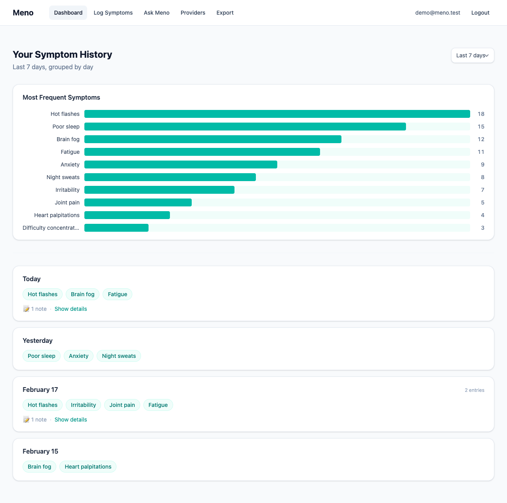
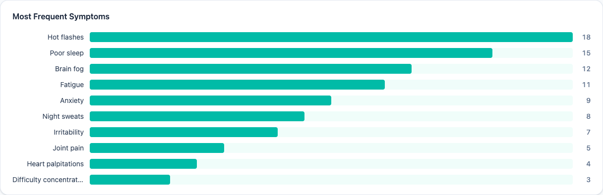
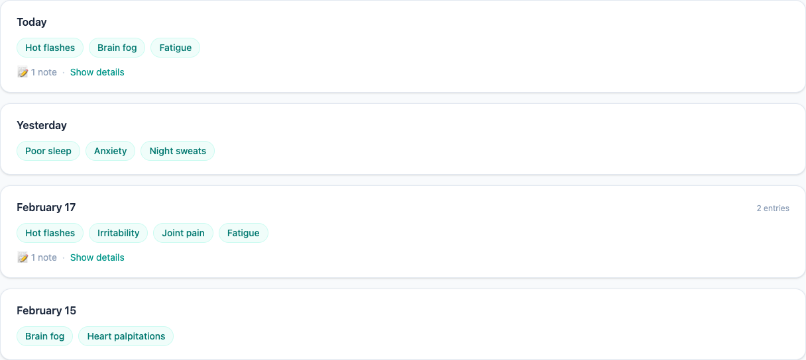
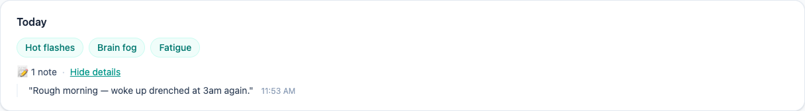
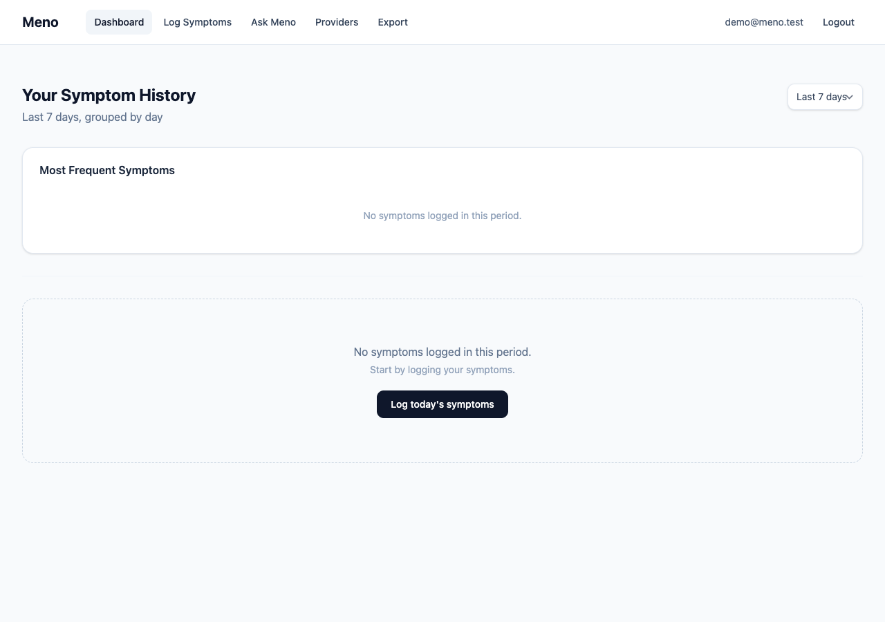

# How to Use Your Dashboard

Your dashboard is the first thing you see after signing in. It shows two things at a glance: which symptoms you've been experiencing most, and a day-by-day history of your logs.

**How to get here:** Click **Dashboard** in the top navigation bar, or sign in — you'll land here automatically.

---

## What you'll see

The dashboard has two sections that update together whenever you change the date range:

1. **Most Frequent Symptoms** — a bar chart showing which symptoms you logged most in the selected period
2. **Your Symptom History** — a day-by-day list of everything you've logged

---

## Changing the date range

In the top-right corner of the page, there's a dropdown to choose how far back to look:

- **Last 7 days** (default)
- **Last 14 days**
- **Last 30 days**

When you change the range, both the chart and the history list update immediately.

---

## The frequency chart

The **Most Frequent Symptoms** card shows a horizontal bar chart of your top 10 most-logged symptoms in the current date range.

Each row shows:
- The symptom name on the left
- A teal bar whose length is proportional to how often it appeared — the longest bar is always your most frequent symptom
- The exact count on the right

**What the count means:** It's the total number of times that symptom appeared across all of your logs, not the number of days. If you logged "Hot flashes" in three separate entries on the same day, it counts as 3.

This chart is calculated entirely from your data — no AI is involved. It's just a straightforward count.

> **This is the feature that validates your experience.** Seeing "Hot flashes: 18" or "Brain fog: 12" in black and white is often the first time a pattern becomes undeniable — proof that what you're feeling is real and worth taking seriously.

---

## Your symptom history

Below the chart, your logs are grouped by day, newest first.

Each day card shows:

- **Date label** — "Today", "Yesterday", or the actual date
- **Symptom pills** — teal badges for each unique symptom you logged that day (duplicates across multiple entries are shown once)
- **Entry count** — if you logged more than once in a day, a small label shows how many entries there were

---

## Viewing your notes

If you wrote any free-text notes when logging, a **📝 notes** link appears at the bottom of that day's card.

Click **Show details** to expand and read your notes. Click **Hide details** to collapse them again.

Notes include the time they were recorded, so you can track when during the day symptoms occurred.

---

## When you haven't logged yet

If the selected time period has no logs, the history section shows an empty state with a link to log today's symptoms.

The frequency chart will also show "No symptoms logged in this period."

---

## Frequently asked questions

**Why are my symptoms shown once per day even though I logged multiple times?**
In the history view, symptoms are deduplicated per day — if "Fatigue" appears in two separate log entries on the same day, it shows as one teal badge. The frequency chart, however, counts all occurrences, so "Fatigue" would count as 2 in that case.

**Why does my chart show fewer symptoms than I expected?**
The chart shows up to 10 symptoms maximum for readability. If you've logged more than 10 distinct symptoms in the period, only the 10 most frequent are shown.

**Does the date range affect both sections?**
Yes. Changing the dropdown updates the frequency chart and the history list at the same time, always showing the same window of time.

**Is this information shared with anyone?**
No. Your symptom data is protected with Row Level Security — only you can access your own logs. See Meno's privacy principles in the [design document](../dev/DESIGN.md#12-privacy--ethics).

**Can I export this data?**
Not yet from this page, but the Export feature (coming in a future update) will let you download a PDF or CSV of your symptom history for sharing with your healthcare provider.

---

## Related

- [How to log your symptoms](how-to-log-symptoms.md)
- [Developer documentation for this feature](../dev/frontend/dashboard.md)
- [Frequency stats API reference](../dev/backend/symptom-stats-api.md)
- [Full design specification](../dev/DESIGN.md#103-dashboard)
