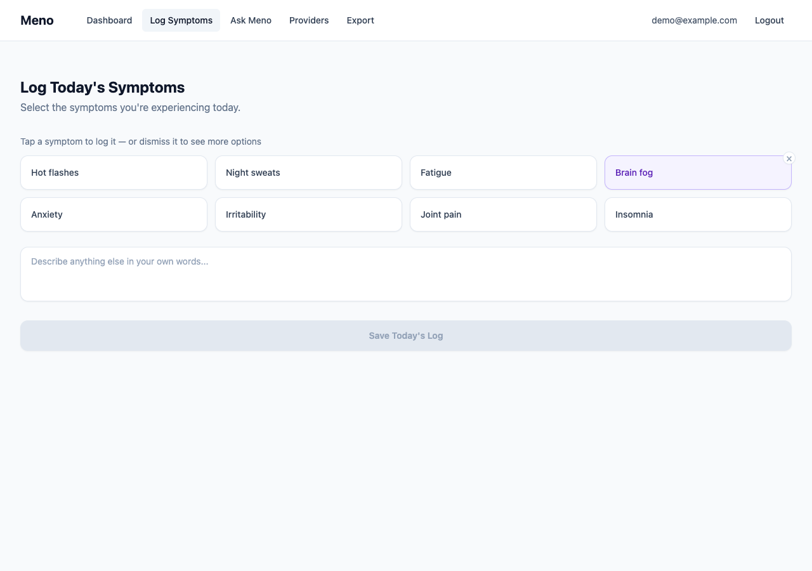
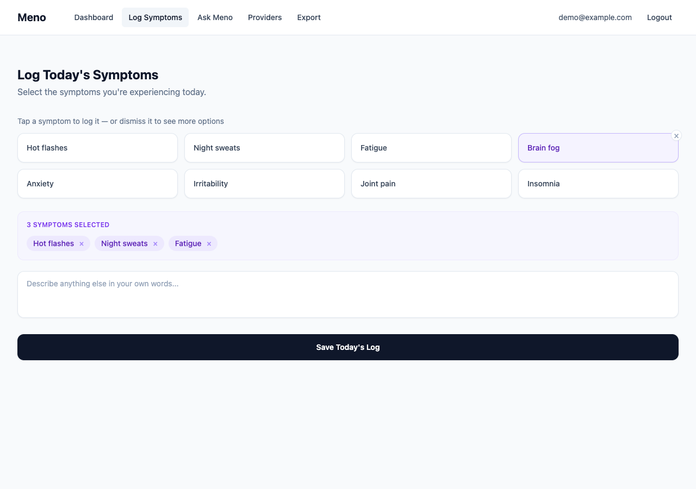
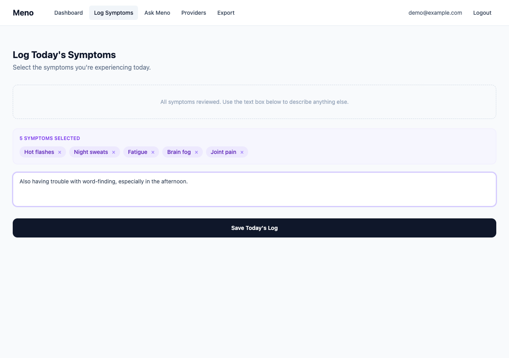
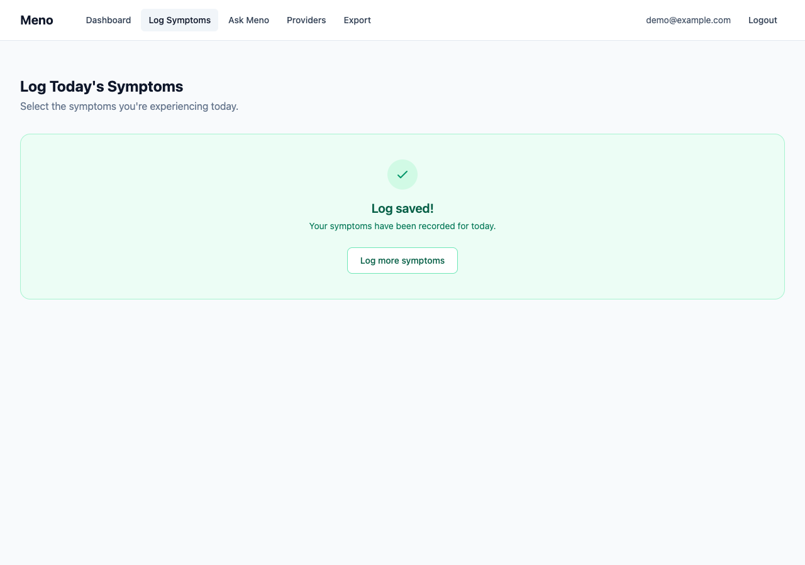

# How to Log Your Symptoms

Logging your symptoms daily is the core habit that makes Meno useful. The more consistently you log, the better Meno can surface patterns in your experience over time.

**How to get here:** Click **Log Symptoms** in the top navigation bar.

---

## What you'll see

When you open the Log Symptoms page, you'll see a grid of symptom cards drawn from Meno's reference list of 34 common perimenopause and menopause symptoms. Eight cards are shown at a time.

---

## Step 1 — Select your symptoms

**Tap any card** to add that symptom to today's log. The card moves into a tray below, and a new card from the pool slides in to take its place.

Your selected symptoms appear as purple chips in the **selected tray**. The tray shows a count so you always know how many you've logged.

---

## Step 2 — Skip symptoms that don't apply

If a card doesn't apply to you today, hover over it and click the small **×** button in its corner to dismiss it. The card disappears and the next symptom in the list slides in. Dismissed cards are gone for the session — they won't keep reappearing.

> **Tip:** Use dismiss to cycle through the full list of 34 symptoms and find ones that are relevant to you today.

---

## Step 3 — Change your mind

**To remove a symptom** you've already selected, click the × on its chip in the purple tray. It returns to the available pool so you can see it again.

---

## Step 4 — Add a note (optional)

The text box is always available below the cards. Use it to describe anything in your own words — things that don't fit neatly into a card, how severe something felt, what might have triggered it, or anything else you want to remember.

You can log **just free text** (without selecting any cards), **just cards**, or **both** — whatever feels right for the day.

---

## Step 5 — Save your log

When you're ready, click **Save Today's Log**. The button is greyed out until you've selected at least one card or written something in the text box.

Once saved, you'll see a confirmation screen.

Click **Log more symptoms** if you want to add another entry for the same day.

---

## When you've reviewed all the cards

If you dismiss enough cards that the pool runs out, the card area is replaced by a gentle message. You can still write in the free text box and save your log.

---

## Frequently asked questions

**Does my log reset if I refresh the page?**
Yes. Dismissed cards and your selections are held in memory for the session only. If you refresh before saving, you'll start fresh. Once you click "Save Today's Log", your entry is stored permanently.

**Can I log the same symptom twice in one day?**
Each symptom card can only be selected once per session. If you want to note severity or timing differences for the same symptom, use the free text box.

**What happens to my free text?**
Your notes are stored exactly as you wrote them. In a future version of Meno, the Ask Meno assistant will be able to reference them when answering your questions.

**Are my logs private?**
Yes. Your symptom logs are protected with Supabase Row Level Security — only you can access your own data. See Meno's privacy principles in the [design document](../dev/DESIGN.md#12-privacy--ethics).

---

## Related

- [Developer documentation for this feature](../dev/frontend/symptom-logging-ui.md)
- [Backend API reference](../dev/backend/symptom-logging-api.md)
- [Full design specification](../dev/DESIGN.md#102-daily-symptom-logging)
