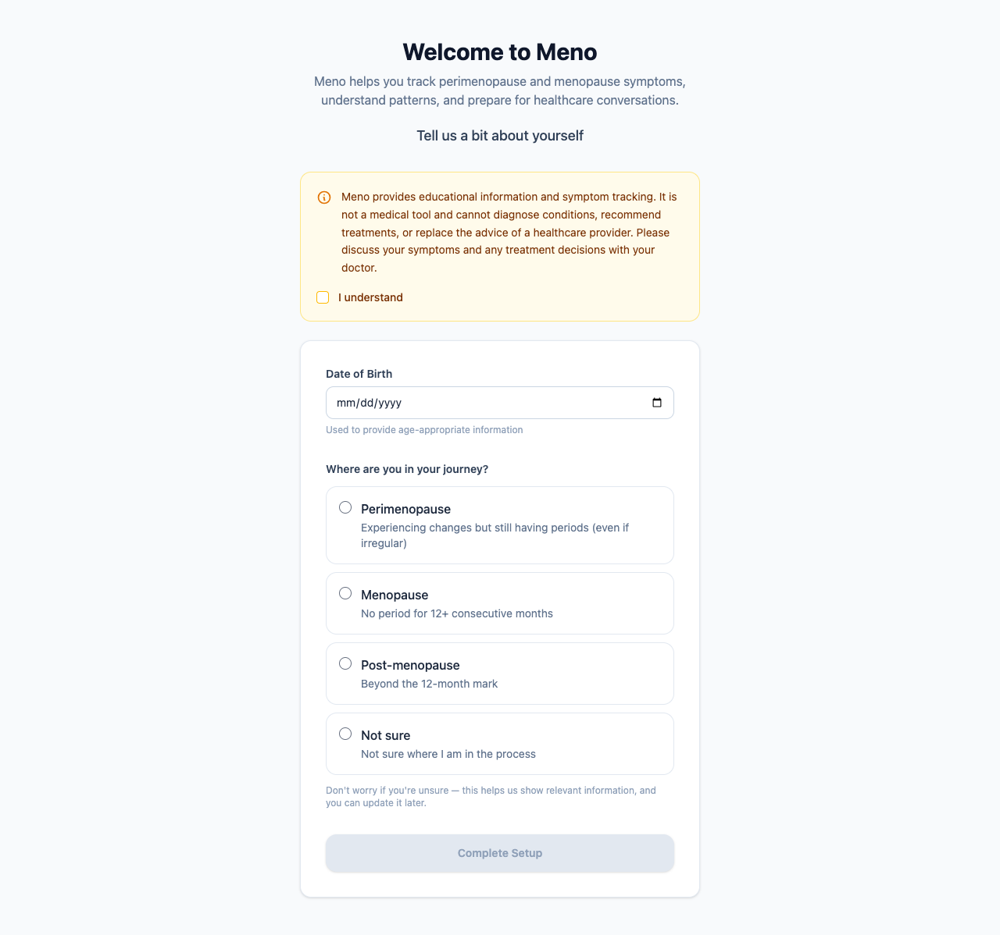
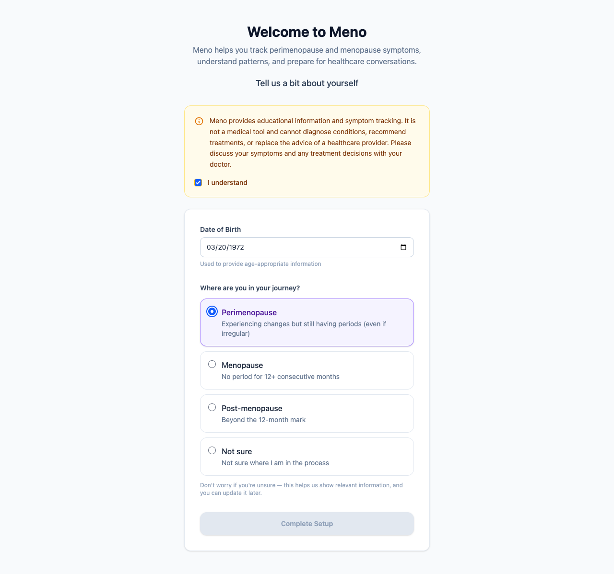
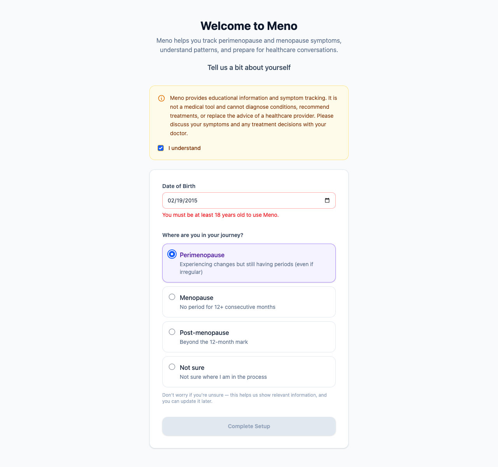
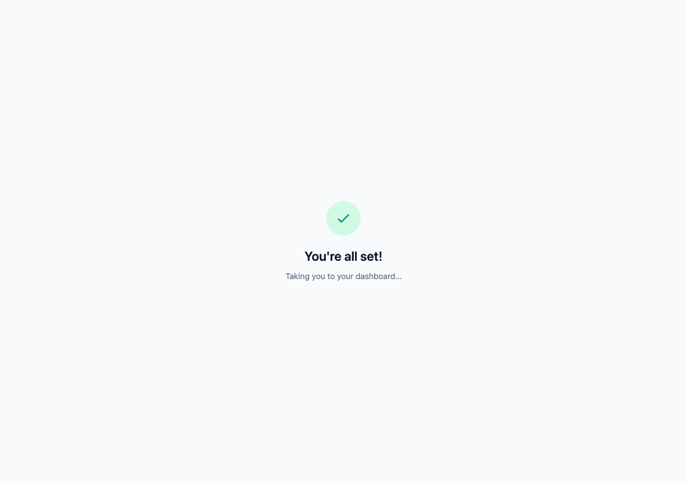

# Getting Started with Meno

When you create a Meno account, you'll see a short setup screen before reaching your dashboard. It takes about a minute to complete.

---

## What you'll see

The setup screen has two parts: a brief disclaimer, and two questions about you.

---

## Step 1 — Read and acknowledge the disclaimer

At the top of the page is a short statement about what Meno is and isn't. Meno is an educational and tracking tool — it can't diagnose conditions or recommend treatments.

Tick the **"I understand"** checkbox to confirm you've read it. The setup button stays greyed out until you do.

---

## Step 2 — Enter your date of birth

Click the **Date of Birth** field and enter your date of birth. Meno uses this to provide age-appropriate context — it's never shared.

> **Note:** Meno is for adults 18 and over. If you enter a date of birth that makes you younger than 18, you'll see a message asking you to correct it.

---

## Step 3 — Choose your journey stage

Select the option that best describes where you are right now:

| Option | What it means |
|---|---|
| **Perimenopause** | You're experiencing changes but still having periods, even if they're irregular |
| **Menopause** | You haven't had a period for 12 or more consecutive months |
| **Post-menopause** | You're beyond that 12-month mark |
| **Not sure** | You're not sure where you are in the process |

Don't worry about picking the "right" answer — this just helps Meno show you relevant information to start with, and you can update it later.

---

## What if I get a date of birth error?

If you enter a date that's today or in the future, or if Meno calculates that you're under 18, you'll see a red message below the date field explaining the issue.

Enter your correct date of birth and the message will clear.

---

## Step 4 — Complete Setup

Once you've ticked the disclaimer and filled in both fields, the **Complete Setup** button becomes active. Click it to save your profile.

You'll see a brief confirmation, then Meno will take you to your dashboard automatically.

---

## Frequently asked questions

**Do I have to complete this before using Meno?**
Yes — the setup screen runs once, the first time you sign in. It only takes a minute, and Meno needs this information before it can personalise anything for you.

**Can I change my journey stage later?**
Yes. Account settings (coming in a future update) will let you update your profile. For now, choose your best guess — "Not sure" is a perfectly valid answer.

**Why does Meno need my date of birth?**
It helps Meno provide age-appropriate context in the information it surfaces. It's stored securely and used only within your account.

**What happens if I close the page partway through?**
Nothing is saved until you click "Complete Setup." You'll see the same setup screen the next time you sign in.

---

## Related

- [How to log your symptoms](how-to-log-symptoms.md)
- [Full design specification](../dev/DESIGN.md#101-onboarding)
- [Developer documentation for this feature](../dev/frontend/onboarding.md)
